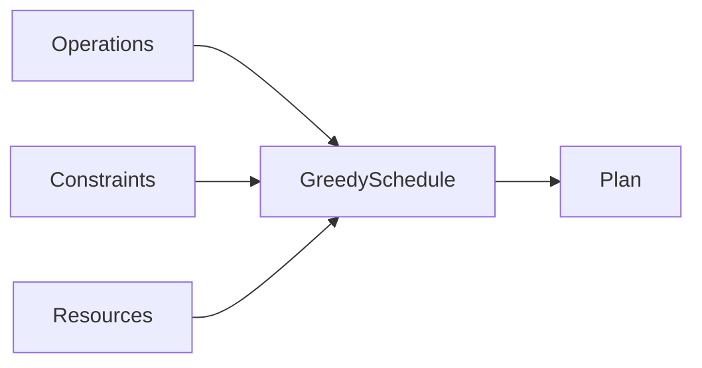

# operations-hub

[](https://github.com/yarkivaev/operations-hub/actions/workflows/ci.yml)

Universal operation-graph scheduling for Scala 3. Plan work against resources
and constraints — lessons, shifts, meetings, or production — without baking a
business process into the library.

Core concepts: `OperationKind`, `Body`, `Operation`, `Resource`, `Constraint`,
`Plan`.

**Artifacts:** `yarkivaev:operations-hub` · `yarkivaev:operations-hub-plan-export` · `yarkivaev:operations-hub-plan-http` · `@yarkivaev/operations-hub-plan-http-client`



## Model

| Concept | Role | School example |
|---------|------|----------------|
| `OperationKind` | Type of work: name, duration, `ResourceRequirement` | algebra, 45 minutes, any classroom |
| `Body` | `Atom(kind)` or `Composite(parts)` | monday contains algebra then history |
| `Operation` | Graph node: `id`, `body`, `successor`, `actual` | `7a/monday/1` → `7a/tuesday/1` |
| `Successor` | `Done` / `Then` / `All` / `OneOf` (priority order) | algebra then history; music or art |
| `Interval` | Half-open `[start, end)` plus optional `ResourceId` | 08:00–08:45 in `room-12` |
| `Resource` | Catalog identity: `id`, `tags` | `room-12`, `gym`, `teacher-anna` |
| `Constraint` | World for this run: `Capacity`, `Forbidden`, `SameInterval` | gym holds two PE classes; lunch closes rooms |
| `Plan` | `OperationId → Interval` for remaining work | the day's timetable |

A composite has no duration and books no room. Its plan interval is the envelope of its parts (`resource = None`). External successors wait for that envelope. Occupancy is booked only by atoms.

Identity vs world: a resource does not carry capacity or unavailability. `Constraint.Capacity(gym, 2)` is how many lessons may occupy that room at once (absent means exclusive `1`). `Constraint.Forbidden` is blocked wall-time (lunch, a closed room). Occupancy is lesson intervals (`actual` and `Plan`), not a constraint.

```scala
val algebra = OperationKind("algebra", Duration.ofMinutes(45), ResourceRequirement.OneOf(List(room12)))
val history = OperationKind("history", Duration.ofMinutes(45), ResourceRequirement.OneOf(List(room12)))
val algebraId = OperationId.unsafe("7a/algebra/1")
val historyId = OperationId.unsafe("7a/history/1")
val mondayId = OperationId.unsafe("7a/monday/1")
val monday = Operation(mondayId, Body.Composite(List(algebraId, historyId)), Successor.Done)
val first = Operation(algebraId, algebra, Successor.Then(historyId))
val second = Operation(historyId, history, Successor.Done)
val timetable = GreedySchedule.live[IO].plan(List(monday, first, second), Nil, List(Resource(room12)), mondayEight)
```

### Warm-start

`Plan` is disposable; the graph holds truth (`actual`, structure). Pass the last plan as
`prior` so feasible lesson rows stay put and only the conflicted tail is re-placed:

```scala
val next = GreedySchedule.live[IO].plan(lessons, constraints, rooms, now, prior = timetable)
```

`prior = Plan.empty` (default) is a full cold plan. Kept rows must still be active atoms,
match kind duration, respect ready floors, and fit capacity / forbidden windows without shifting.

API details live in Scaladoc on the types above.

## Install

GitHub Packages (Maven):

```scala
resolvers += "GitHub operations-hub" at "https://maven.pkg.github.com/yarkivaev/operations-hub"
libraryDependencies += "yarkivaev" %% "operations-hub" % "0.5.0"
```

npm client (GitHub Packages):

```
@yarkivaev:registry=https://npm.pkg.github.com
```

```bash
npm install @yarkivaev/operations-hub-plan-http-client
```

## Modules

| Module | Role |
|--------|------|
| root | Operation graph + greedy plan |
| `plan-export/` | CSV render of `Plan` |
| `plan-http/` | Immutable read routes over graph + `Plan` |
| `plan-http-client/` | JS read client for plan-http |

## Development

```bash
./scripts/sbt test
./scripts/sbt planExport/test
./scripts/sbt planHttp/test
./scripts/sbt planHttp/run
cd plan-http-client && npm test
```

Demo server: `GET /health`, `GET /api/v1/meta`, `GET /api/v1/plan`, `GET /api/v1/timeline`.
